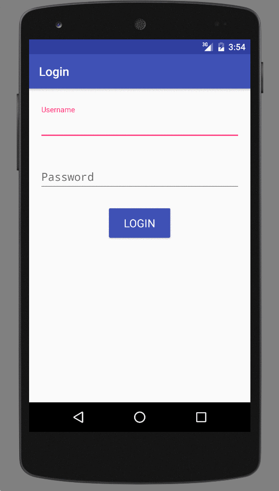

# HyperTrack example Android apps

Example application built with the `HyperTrack SDK` for Android. For the iOS equivalent, refer to [example-ios](https://github.com/hypertrack/example-ios).

## Example modules
1. app - example of integration with `HyperTrack SDK`, which transmits location data for HyperTrack User

## Requirements
1. Android studio with emulator (or test device)
2. HyperTrack API keys. Learn more about them [here](https://docs.hypertrack.com/v3/gettingstarted/authentication.html).

## Usage:

The example application implements tracking a User in the background as well as tracking a User on an Action. Read our [introduction](https://docs.hypertrack.com/) to know more.

Recommended: Take a look at the Android [documentation](https://docs.hypertrack.com/v3/sdks/android/installing.html).

**STEPS**

1. Sync the Gradle files to download the HyperTrack SDKs.
2. Replace `YOUR_PUBLISHABLE_KEY` with your key in `ExampleAppApplication.java`.
3. Run in emulator. You might need to enable the location permission: see [how](readme-imgs/location.gif).

## Documentation
For detailed documentation of the methods and customizations, please visit the official [docs](https://docs.hypertrack.com/).

## Contribute
Please use the [issues tracker](https://github.com/hypertrack/example-android/issues) to raise bug reports and feature requests. We'd love to see your pull requests - send them in!

## Support
Join our [Slack community](http://slack.hypertrack.com) for instant responses. You can also email us at help@hypertrack.com.
